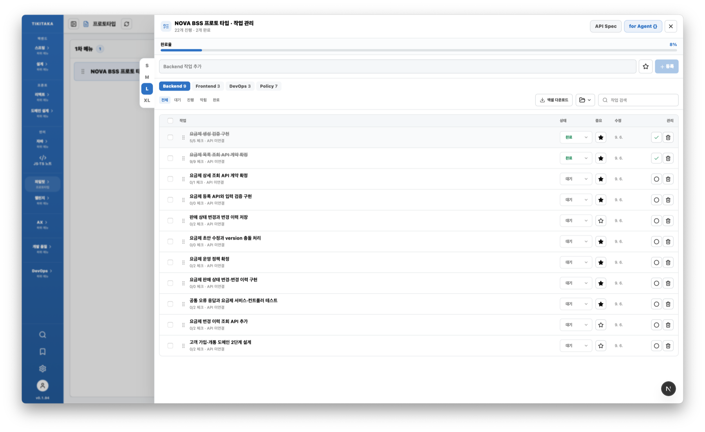
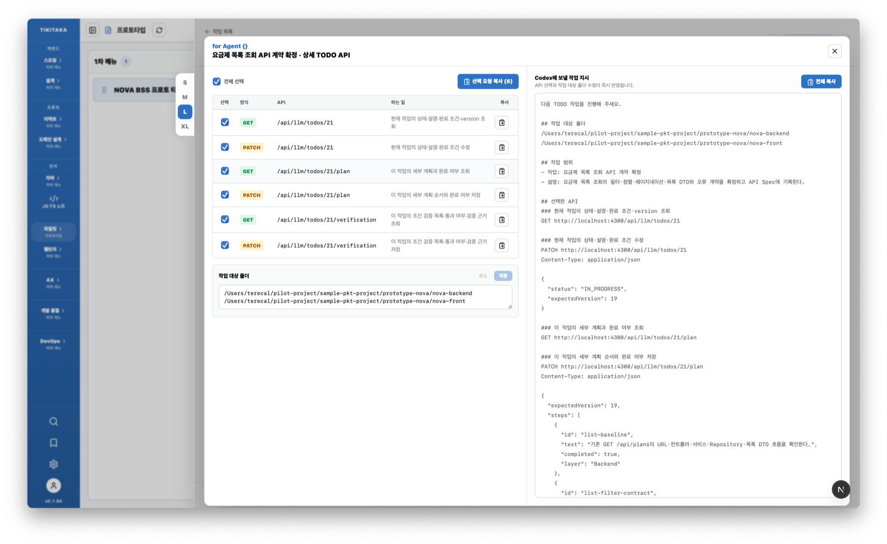
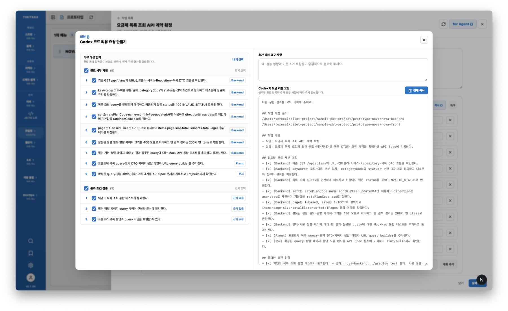
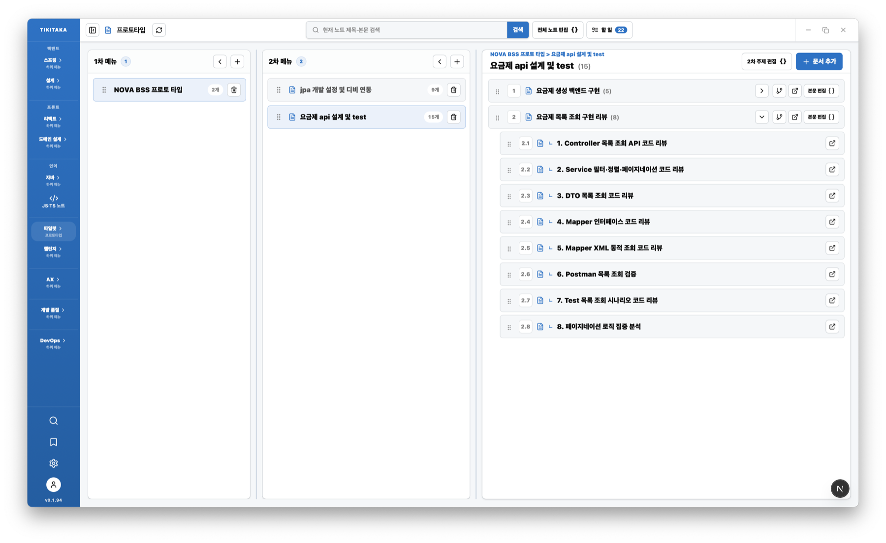

# 티키타카 개발 노트

> 학습 50 : 개발 50 — 사람과 AI Agent가 함께 배우고, 만들고, 리뷰하며 지식을 축적하는 바이브 코딩 기반 학습 노트 앱

[](https://github.com/dota-pilot1/pkt-study-fullstack/releases/latest)
[](https://tauri.app/)
[](https://nextjs.org/)
[](https://sqlite.org/)

## 목차

- [다운로드](#다운로드)
- [어떤 앱인가요?](#어떤-앱인가요)
- [할 일 → 구현 → 리뷰 → 노트](#할-일--구현--리뷰--노트)
- [프로젝트가 만드는 가치](#프로젝트가-만드는-가치)
- [가볍게 설치하고 공유하는 구조](#가볍게-설치하고-공유하는-구조)
- [로컬 개발](#로컬-개발)
- [SQLite 데이터 보존](#sqlite-데이터-보존)
- [앞으로의 방향](#앞으로의-방향)

## 다운로드

**[최신 버전 다운로드 — GitHub Releases](https://github.com/dota-pilot1/pkt-study-fullstack/releases/latest)**

최신 릴리즈 페이지에서 사용하는 운영체제에 맞는 설치 파일을 받을 수 있습니다.

- macOS: `.dmg`
- Windows: NSIS 설치 파일 `.exe`
- 현재 최신 버전: `v0.1.94`

## 어떤 앱인가요?

티키타카 개발 노트는 코드를 빠르게 생성하는 것만을 목표로 하지 않습니다. 실제 프로젝트에서 발생한 할 일, 구현 과정, 리뷰 결과와 새롭게 학습한 내용을 다시 찾고 활용할 수 있는 개발 지식으로 바꿉니다.

```text
할 일 정의 → 구현 지시·검증 → 코드 리뷰 → 노트 정리 → 다음 작업에 재사용
```

개발 속도와 학습 깊이를 **5:5 피프티 피프티**로 가져가며 다음 영역을 함께 다룹니다.

- 기본기 강화
- 언어와 프레임워크 학습
- 메이저 스펙의 이해와 적용
- 실제 기능 개발과 프로토타이핑
- 코드 리뷰와 기술 부채 해결

## 할 일 → 구현 → 리뷰 → 노트

실제 SKT Nova 프로토타입 작업을 기준으로, 하나의 개발 경험이 다음 작업에 재사용되는 지식으로 바뀌는 과정입니다.

### 01. 할 일 — 목표와 완료 기준 정의



Backend, Frontend, DevOps, Policy 등 작업 흐름별로 할 일을 분류합니다. 진행률, 중요도, 상태, 체크리스트, 완료 기준과 API 연결 여부를 관리해 **무엇을 왜 만들어야 하는지** 먼저 명확히 합니다.

### 02. 구현 — `for Agent {}`로 구체적인 작업 지시



선택한 TODO의 상태·세부 계획·검증 조건 API와 백엔드·프론트 작업 폴더를 하나의 구현 지시로 만듭니다. Agent는 이 지시를 따라 구현하고, 진행 상태와 검증 근거를 다시 앱에 기록합니다.

### 03. 리뷰 — 완료 계획과 통과 조건으로 코드 검증



구현이 끝난 세부 계획과 통과 조건을 선택해 Codex 리뷰 요청을 생성합니다. 백엔드·프론트 작업 경로, API 계약, 필터·정렬·페이지네이션 조건과 테스트 근거가 함께 전달되므로 구현 결과를 요구사항과 비교해 검토할 수 있습니다.

### 04. 노트 — 구현과 리뷰의 맥락을 지식으로 축적



1차 메뉴 → 2차 주제 → 본문 문서 → 하위 문서 구조로 프로젝트의 맥락을 정리합니다. 요금제 API 설계, 백엔드 구현과 세부 코드 리뷰를 연결하고, Lexical의 코드 블록·표·Mermaid 다이어그램으로 구현 가능한 개발 문서를 만듭니다.

리뷰에서 확인한 개선점과 선택의 이유는 다시 노트에 반영되고, 정리된 지식은 다음 할 일의 출발점이 됩니다. 앱의 `API for LLM`과 문서 작성 예제를 이용하면 Agent도 현재 구조와 작성 규칙을 이해한 상태에서 노트를 작성하거나 수정할 수 있습니다.

## 프로젝트가 만드는 가치

| 가치 | 실제 활용 |
| --- | --- |
| 학습과 개발의 연결 | 공부한 개념을 실제 기능에 적용하고 구현 경험을 다시 학습 자료로 만듭니다. |
| 설계와 프로토타이핑 | 문제, 사용자, 데이터와 업무 흐름을 정리한 뒤 화면과 기능으로 빠르게 검증합니다. |
| 개발 자산 재사용 | 프롬프트, API 규칙, 공통 컴포넌트와 해결 사례를 다음 작업에 활용합니다. |
| 검색 가능한 작업 기억 | 과거 결정, 오류 해결 기록과 리뷰 내용을 필요한 순간 찾습니다. |
| 온보딩 지원 | 신규 개발자가 프로젝트 구조와 구현 맥락을 더 빠르게 파악할 수 있습니다. |

현재는 **SKT Nova 프로젝트를 위한 프로토타입의 백엔드와 프론트 구현 과정**을 노트로 정리하고 있습니다.

더 자세한 설명은 [티키타카 개발 노트 소개 페이지](docs/tikitaka-note-introduction.html)에서 확인할 수 있습니다.

## 가볍게 설치하고 공유하는 구조

| 기술 | 역할 |
| --- | --- |
| Tauri 2 | 가벼운 데스크톱 앱 패키징과 자동 업데이트 |
| Next.js 16 + React 19 | 화면과 로컬 API를 구성하는 풀스택 기반 |
| SQLite + Drizzle ORM | 별도 DB 서버 없이 노트와 작업 데이터 보관 |
| Lexical | 리치 텍스트 기반 개발 노트 편집 |
| TanStack Query | 서버 상태 조회와 캐시 관리 |

앱, 기능과 기준 학습 데이터를 함께 패키징하므로 복잡한 서버 환경 없이 개인 또는 팀에 배포하기 쉽습니다. 사용자 노트는 앱 번들과 분리된 Tauri 사용자 데이터 경로에 저장되어 업데이트 이후에도 유지됩니다.

## 로컬 개발

### 요구 사항

- Node.js 20 이상
- npm
- 데스크톱 앱 빌드 시 Tauri 2 개발 환경

### 웹 개발 서버

```bash
npm install
npm run dev
```

브라우저에서 `http://localhost:4300`에 접속합니다.

### Tauri 데스크톱 앱

```bash
npm run tauri dev
```

## 검증

```bash
npm run lint
npm run build
npm run check:server-architecture
```

## SQLite 데이터 보존

로컬 개발에서는 프로젝트 루트의 `.data/pkt-study.db`를 사용합니다. Tauri 릴리즈 빌드는 기준 DB를 첫 실행용 seed로 패키징하고, 설치 앱은 이를 Tauri 사용자 데이터 경로에 복사해 사용합니다.

앱 업데이트나 재설치로 번들이 교체되어도 사용자 노트는 유지됩니다. 설치 앱의 백업·복원은 앱 설정의 SQLite 백업 기능을 사용합니다. `PKT_STUDY_DATA_DIR`는 Tauri가 자동으로 주입하므로 릴리즈 업데이트에서 앱 번들 경로로 변경하면 안 됩니다.

## 앞으로의 방향

MCP와 RAG를 연결해 작업과 관련된 노트를 자동으로 찾고, 팀에서 검증한 규칙과 구현 사례를 Agent가 근거로 활용할 수 있는 개발 지식 정보 시스템으로 확장할 계획입니다.

---

**Release:** https://github.com/dota-pilot1/pkt-study-fullstack/releases/latest<br>
**Repository:** https://github.com/dota-pilot1/pkt-study-fullstack
